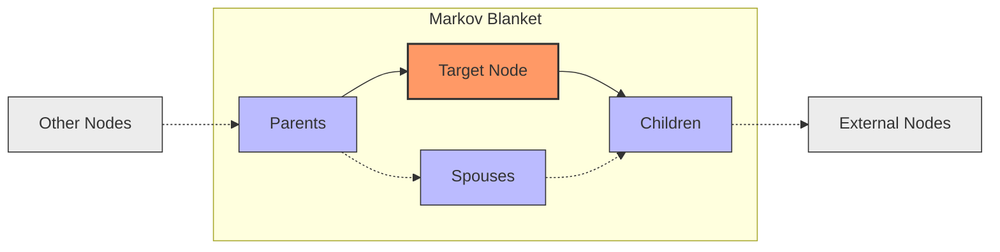
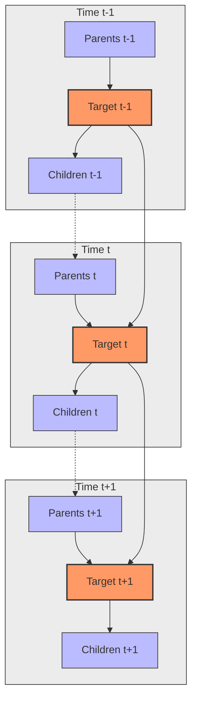
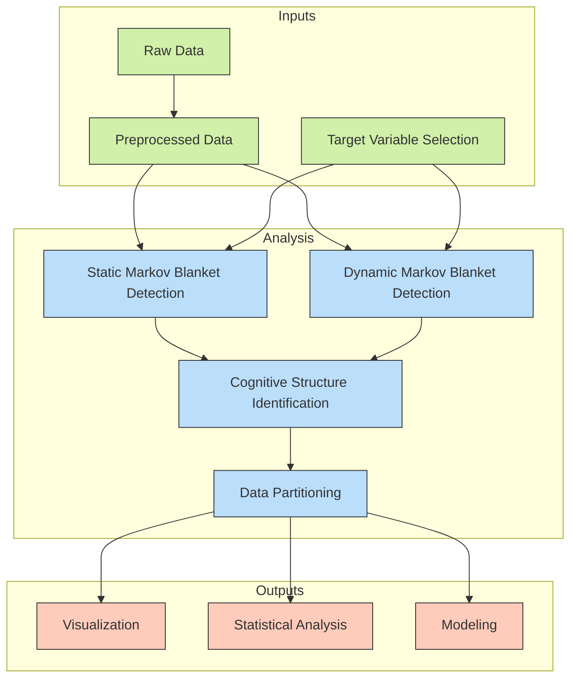
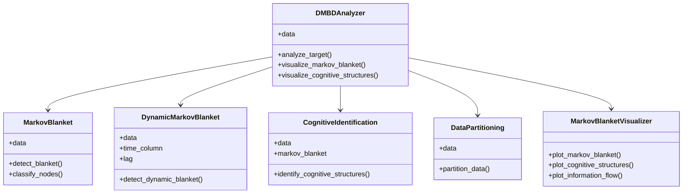
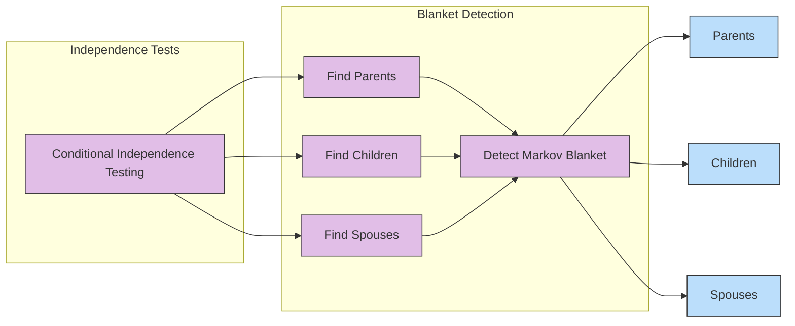
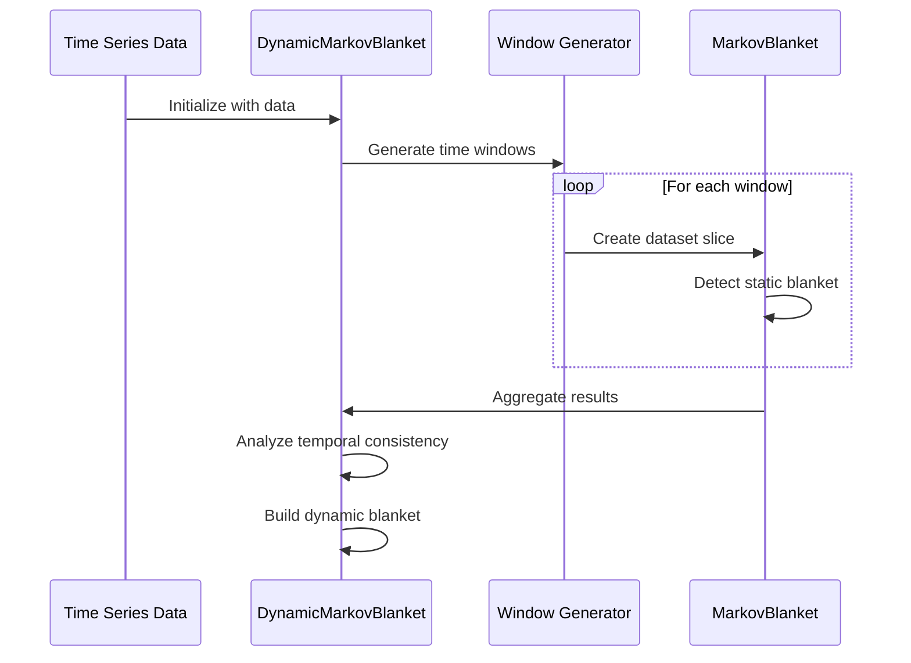
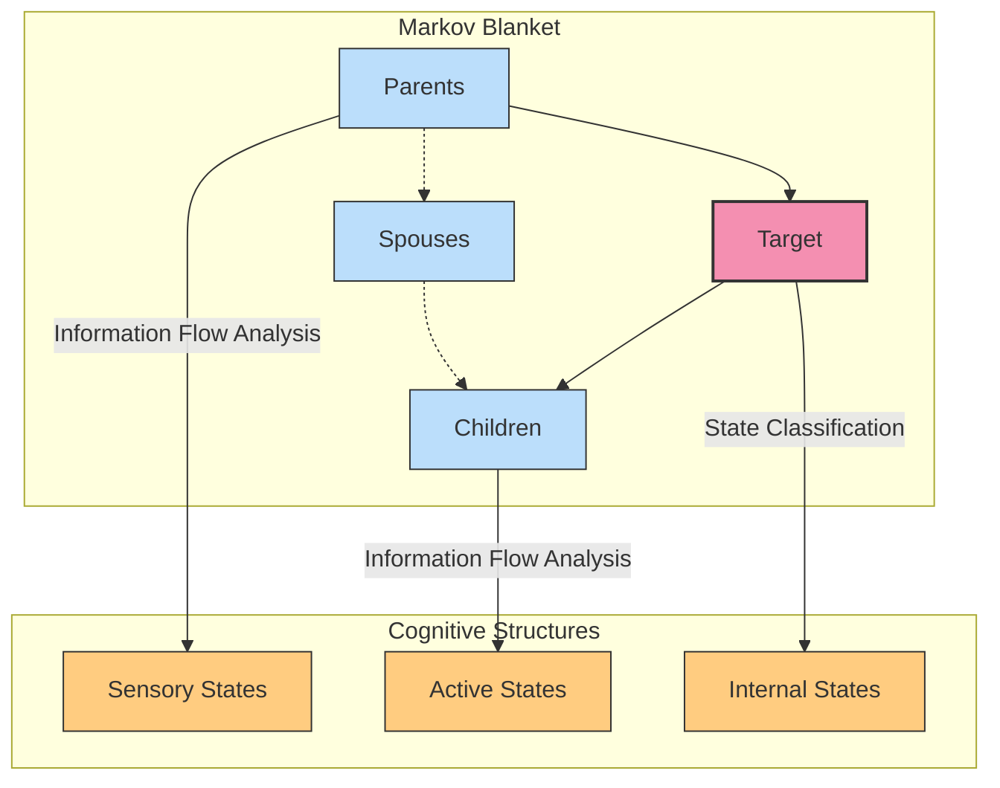
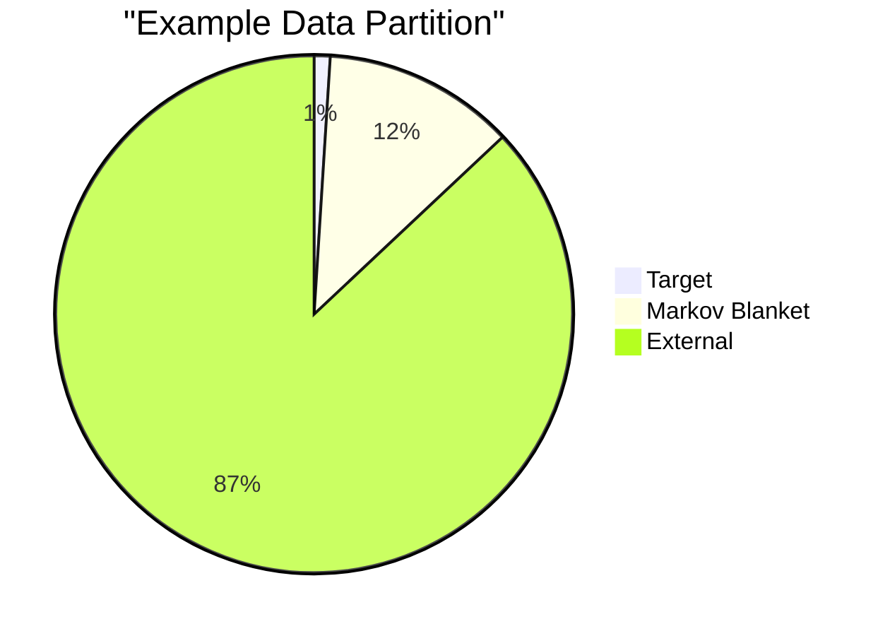
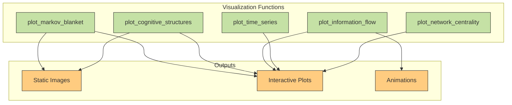

# Dynamic Markov Blanket Detection (DMBD)

A comprehensive framework for detecting and analyzing Markov blankets in dynamic systems using probabilistic techniques based on PyTorch.

## Overview

Dynamic Markov Blanket Detection (DMBD) provides tools for identifying causal relationships in complex systems by detecting and analyzing Markov blankets. A Markov blanket for a node in a graph consists of its parents, children, and the parents of its children (spouses), and shields the node from the rest of the network - making the node conditionally independent of all other variables given its Markov blanket.

This framework extends traditional static Markov blanket detection to dynamic systems, allowing for the detection of temporal dependencies and the evolution of Markov blankets over time.

## Acknowledgments

- The framework builds on concepts from causal inference, information theory, and active inference frameworks
- This repository was written from scratch using Cursor and Claude 3.7 on March 13, 2025, inspired by:
  - [pyDMBD](https://github.com/bayesianempirimancer/pyDMBD)
  - [Dynamic Markov Blanket Detection for Macroscopic Physics Discovery](https://arxiv.org/abs/2502.21217) (Beck & Ramstead, 2025)


### Markov Blanket Structure



### Dynamic Markov Blanket 



## Features

- **Markov Blanket Detection**: Identify the Markov blanket of target variables in static data
- **Dynamic Markov Blanket Detection**: Detect time-varying Markov blankets in temporal data
- **Cognitive Structure Identification**: Identify cognitive structures (sensory, action, internal states) within Markov blankets
- **Data Partitioning**: Tools for partitioning data based on Markov blanket components
- **Visualization**: Rich visualization tools for Markov blankets, cognitive structures, and information flow
- **Comprehensive Interface**: High-level interface for analysis combining all components
- **PyTorch Integration**: Built on PyTorch for GPU acceleration and deep learning compatibility

### DMBD Analysis Workflow



## Installation

### Prerequisites

- Python 3.8+
- PyTorch 1.12+

### Using pip

```bash
pip install dmbd
```

### Development Installation

```bash
git clone https://github.com/openmanus/dmbd.git
cd dmbd
pip install -e .
```

## Quick Start

```python
import pandas as pd
import numpy as np
from dmbd.src.dmbd_analyzer import DMBDAnalyzer

# Load data
data = pd.read_csv('your_data.csv')

# Initialize analyzer
analyzer = DMBDAnalyzer(data)

# Analyze target variable
target_idx = 0  # Index of the target variable
results = analyzer.analyze_target(target_idx)

# Print basic results
print(f"Markov Blanket for X{target_idx}:")
print(f"  Parents: {results['markov_blanket']['parents']}")
print(f"  Children: {results['markov_blanket']['children']}")
print(f"  Spouses: {results['markov_blanket']['spouses']}")
print(f"  Blanket Size: {results['markov_blanket']['blanket_size']}")

# Visualize Markov blanket
analyzer.visualize_markov_blanket(target_idx)

# Visualize cognitive structures
analyzer.visualize_cognitive_structures(target_idx)
```

## Synthetic Data Example

The framework includes tools for generating synthetic data for testing:

```python
from dmbd.src.examples import generate_synthetic_data, basic_markov_blanket_example

# Generate synthetic data
data = generate_synthetic_data(
    n_samples=500,
    n_vars=8,
    causal_density=0.3,
    temporal=True,
    n_time_points=5
)

# Or run the built-in example
basic_markov_blanket_example()
```

## Framework Components

### Component Relationships



### MarkovBlanket

Detects Markov blankets in static data using conditional independence tests.

```python
from framework.markov_blanket import MarkovBlanket

mb = MarkovBlanket(data)
parents, children, spouses = mb.detect_blanket(target_idx)
```



### DynamicMarkovBlanket

Extends Markov blanket detection to temporal data.

```python
from framework.markov_blanket import DynamicMarkovBlanket

dmb = DynamicMarkovBlanket(data, time_column='time', lag=2)
dynamic_blanket = dmb.detect_dynamic_blanket(target_idx)
```



### CognitiveIdentification

Identifies cognitive structures within Markov blankets.

```python
from framework.cognitive_identification import CognitiveIdentification

ci = CognitiveIdentification(data, mb)
structures = ci.identify_cognitive_structures(target_idx)
```



### DataPartitioning

Tools for partitioning data based on Markov blanket components.

```python
from framework.data_partitioning import DataPartitioning

dp = DataPartitioning(data)
classifications = mb.classify_nodes(target_idx)
partitions = dp.partition_data(classifications)
```



### MarkovBlanketVisualizer

Visualization tools for Markov blankets and cognitive structures.

```python
from framework.visualization import MarkovBlanketVisualizer

visualizer = MarkovBlanketVisualizer()
fig = visualizer.plot_markov_blanket(mb, target_idx)
```



## Running Tests

To run the test suite:

```bash
python -m unittest discover tests
```

Or to run a specific test:

```bash
python -m unittest tests.test_markov_blanket
```

## Contributing

Contributions are welcome! Please feel free to submit a Pull Request.

## License

This project is licensed under the Creative Commons Attribution-NonCommercial-ShareAlike 4.0 International License - see the [LICENSE.md](LICENSE.md) file for details.
